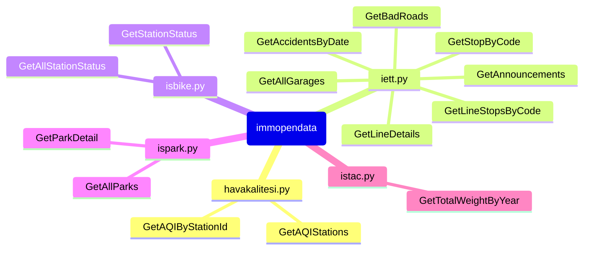

# Example Package

This is a simple example package. You can use
[Github-flavored Markdown](https://guides.github.com/features/mastering-markdown/)
to write your content.

Here is a simple flow chart:

