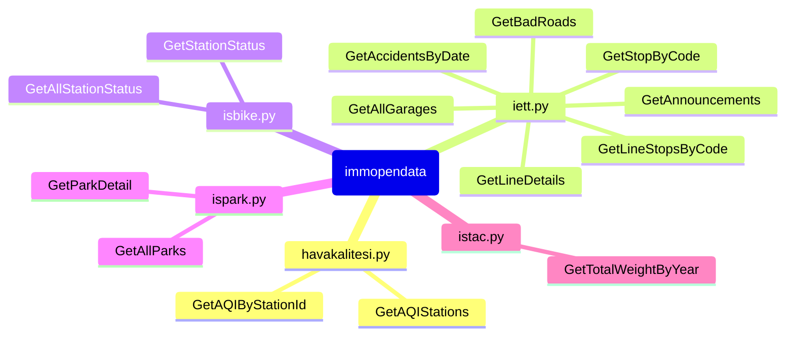

# immopendata

A small package to use data provided by `Istanbul Metropolitan Municipality(IMM) Open Data Portal`

```pycon
python -m pip install immopendata
```



```python
from datetime import datetime
from immopendata.havakalitesi import (
    GetAQIStations,
    GetAQIByStationId
    )

stations = GetAQIStations()

C, A  = GetAQIByStationId(
    stationId='6b7a9840-1e13-4045-a79d-0f881c4852ad',
    startDate=datetime(2023,11,2),
    endDate=datetime(2023,11,3)
    )

# [Stations]
# {'Id': '6b7a9840-1e13-4045-a79d-0f881c4852ad', 'Name': 'Maslak', 'Address': 'İstanbul / Sarıyer - Turkey', 'Latitude': 41.10007237141238, 'Longitude': 29.02451200417135}
# {'Id': '914b525e-f275-41e1-b45b-118ada8f08c3', 'Name': 'Esenler', 'Address': 'İstanbul / Esenler - Turkey', 'Latitude': 41.03687140756281, 'Longitude': 28.88807104966004}
# ...
# {'Id': '30a7a252-f4ea-43f8-a8db-fdea5ca332d3', 'Name': 'Tuzla', 'Address': 'İstanbul - Tuzla', 'Latitude': 40.843121743887025, 'Longitude': 29.302621843152615}
# 
# [Concentration]
# {'PM10': 45.1, 'SO2': 3.8, 'O3': 66.1, 'NO2': 33.5, 'CO': None, 'ReadTime': '2023-11-02T00:00:00'}
# {'PM10': 54.8, 'SO2': 3.0, 'O3': 53.4, 'NO2': 25.4, 'CO': None, 'ReadTime': '2023-11-02T01:00:00'}
# ...
# {'PM10': 19.6, 'SO2': 3.4, 'O3': 54.2, 'NO2': 58.1, 'CO': None, 'ReadTime': '2023-11-03T00:00:00'}
# 
# [Air Quality Index]
# {'PM10': 48.0, 'SO2': 2.0, 'O3': 30.0, 'NO2': 16.0, 'CO': None, 'AQIIndex': 48.0, 'ContaminantParameter': 'PM10', 'State': 'Hava kalitesi memnun edici ve hava kirliliği az riskli veya hiç risk teşkil etmiyor.', 'Color': '#13a261', 'ReadTime': '2023-11-02T00:00:00'}
# {'PM10': 47.0, 'SO2': 2.0, 'O3': 29.0, 'NO2': 12.0, 'CO': None, 'AQIIndex': 47.0, 'ContaminantParameter': 'PM10', 'State': 'Hava kalitesi memnun edici ve hava kirliliği az riskli veya hiç risk teşkil etmiyor.', 'Color': '#13a261', 'ReadTime': '2023-11-02T01:00:00'}
# ...
# {'PM10': 38.0, 'SO2': 2.0, 'O3': 26.0, 'NO2': 28.0, 'CO': None, 'AQIIndex': 38.0, 'ContaminantParameter': 'PM10', 'State': 'Hava kalitesi memnun edici ve hava kirliliği az riskli veya hiç risk teşkil etmiyor.', 'Color': '#13a261', 'ReadTime': '2023-11-03T00:00:00'}
```

```python
from datetime import datetime
from immopendata.iett import (
    GetStopByCode,
    GetAllGarages,
    GetAnnouncements,
    GetBadRoads,
    GetAccidentsByDate,
    GetLineStopsByCode,
    GetLineDetails
    )

stop = GetStopByCode(100002)
# {'Accessibility': 'Uygun Degil',
# 'Direction': 'BOGAZKÖY',
# 'District': 'Esenyurt',
# 'IsSmart': 'YOK',
# 'Latitude': 41.0190470005563,
# 'Longitude': 28.6846599999755,
# 'PhysicalCondition': 'FULL KAPALI',
# 'StopCode': '100002',
# 'StopName': 'RIFAT ILGAZ CADDESİ',
# 'Type': 'İETTCAMLI'}

garages = GetAllGarages()
# {'GarageCode': 'GÖHO04', 'GarageId': '50022', 'GarageName': 'BEYLIKDÜZÜ'},
# {'GarageCode': 'GÖHO15', 'GarageId': '50023', 'GarageName': 'CENDERE PARKI'},
# ...
# {'GarageCode': 'G_SRG', 'GarageId': '5249879', 'GarageName': 'SARIGAZIGARAJI'}

anns = GetAnnouncements()
# [{'LineCode': 'MK12',
#   'LineName': 'OLIMPIYATKÖY METRO - GÜVERCINTEPE - KAYASEHIR ',
#   'Message': 'YESILYURT SOKAK KAYGAN ZEMIN NEDENIYLE KAPALI OTOBÜSLERIMIZ '
#              'OLIMPIYAT METRO YÖNÜNDE KAYASEHIR YOLU DURAGINDAN SONRA '
#              'GÜZERGAHTAN AYRILARAK KAYABASI KIPTAS DURAGINDAN GÜZERGAHA '
#              'GIRECEKTIR\t',
#   'Type': 'Günlük',
#   'UpdateTime': '07:23'},
# ...
#  {'LineCode': 'MR42',
#   'LineName': 'HALKALI MARMARAY / INÖNÜ MAH. - SEFAKÖY METROBÜS',
#   'Message': 'GÜZERGAHTAKI YOGUN TRAFIK NEDENIYLE ARAÇLARIMIZ HALKALI MARMARAY '
#              'KALKISLI SEFERLERINE 20 DAKIKA VE ÜZERI RÖTARLI HAREKET '
#              'ETMEKTEDIR.',
#   'Type': 'Günlük',
#   'UpdateTime': '09:27'}]

badRoads = GetBadRoads()
# [{'BusId': 'C-1653',
#   'DriveId': '854859',
#   'Latitude': 41.005672999999994,
#   'Longitude': 29.257862,
#   'Message': 'BOZUK SATIH',
#   'MessageId': '4975964',
#   'UpdateDate': '2023-11-03T09:46:52.153+03:00'},
# ...
#  {'BusId': 'C-458',
#   'DriveId': '800159',
#   'Latitude': 40.82919416666667,
#   'Longitude': 29.359960166666664,
#   'Message': 'BOZUK SATIH',
#   'MessageId': '4971815',
#   'UpdateDate': '2023-11-03T05:53:30.174+03:00'}]

accidents = GetAccidentsByDate(datetime(2022,1,5))
# [{'AccidentDate': '2022-01-05T00:00:00+03:00',
#   'Latitude': 41.10858,
#   'Longitude': 29.041588,
#   'Type': 'Kaza'},
# ...
#  {'AccidentDate': '2022-01-05T00:00:00+03:00',
#   'Latitude': 41.02114,
#   'Longitude': 28.959941999999998,
#   'Type': 'Kaza'}]

stops = GetLineStopsByCode('500T')
# [{'BusinessRegion': 'Anadolu2',
# 'Direction': 'D',
# 'District': 'Tuzla',
# 'Latitude': 40.83637,
# 'LineCode': '500T',
# 'Longitude': 29.369951,
# 'SequenceNo': '75',
# 'StopCode': '225792',
# 'StopName': 'GÖNÜL SOK-ŞEHİT BAYRAM AKSU',
# 'SubRegion': 'Pendik',
# 'Type': 'İETTBAYRAK'},
# ...
# {'BusinessRegion': 'Anadolu2',
# 'Direction': 'G',
# 'District': 'Çayirova',
# 'Latitude': 40.827651,
# 'LineCode': '500T',
# 'Longitude': 29.365008,
# 'SequenceNo': '1',
# 'StopCode': '401351',
# 'StopName': 'ŞİFA SONDURAK',
# 'SubRegion': 'Pendik',
# 'Type': 'İETTCAMLI'},
# ...
# 'BusinessRegion': 'Anadolu2',
# 'Direction': 'G',
# 'District': 'Tuzla',
# 'Latitude': 40.836164,
# 'LineCode': '500T',
# 'Longitude': 29.370079,
# 'SequenceNo': '5',
# 'StopCode': '225791',
# 'StopName': 'GÖNÜL SOK-ŞEHİT BAYRAM AKSU',
# 'SubRegion': 'Pendik',
# 'Type': 'İETTCAMLI'}]

details = GetLineDetails('500T')
# {'BusinessRegion': 'Anadolu2',
#  'LineCode': '500T',
#  'LineFullName': '500T/TUZLA ŞİFA MAHALLESİ - CEVİZLİBAĞ',
#  'LineName': 'TUZLA ŞİFA MAHALLESİ - CEVİZLİBAĞ',
#  'LineStatus': '1',
#  'TravelTime': '345.11'}
```

```python
from immopendata.isbike import (
    GetStationStatus,
    GetAllStationStatus
    )

stations = GetAllStationStatus()
# [{'EmptyCapacity': 14,
#  'FullCapacity': 1,
#  'Id': 375,
#  'IsOpen': True,
#  'Latitude': 40.92287435876564,
#  'Longitude': 29.119799323165758,
#  'Name': 'Orhangazi Köprü - 2 ',
#  'No': 1602,
#  'UpdateTime': '2023-11-04T02:39:20'},
# ...
#  {'EmptyCapacity': 7,
#  'FullCapacity': 8,
#  'Id': 784,
#  'IsOpen': True,
#  'Latitude': 40.924996,
#  'Longitude': 29.117321,
#  'Name': 'Maltepe Dolgu Alanı Yalı Boyu ',
#  'No': 1611,
#  'UpdateTime': '2023-11-04T02:39:03'}]

status = GetStationStatus(375)
# {'EmptyCapacity': 14,
#  'FullCapacity': 1,
#  'Id': 375,
#  'IsOpen': True,
#  'Latitude': 40.92287435876564,
#  'Longitude': 29.119799323165758,
#  'Name': 'Orhangazi Köprü - 2 ',
#  'No': 1602,
#  'UpdateTime': '2023-11-04T02:39:20'}
```

```python
from datetime import datetime
from immopendata.ispark import (
    GetAllParks,
    GetParkDetail
    )

parks = GetAllParks()
# [{'Capacity': 30,
#  'District': 'SARIYER',
#  'EmptyCapacity': 23,
#  'FreeTime': 15,
#  'Id': 1590,
#  'IsOpen': False,
#  'Latitude': 41.1146,
#  'Longitude': 29.0588,
#  'Name': 'İstinye 9 (İdo İskele Önü)',
#  'Type': 'YOL ÜSTÜ',
#  'WorkHours': '08:00-18:00'},
# ...
# {'Capacity': 30,
#  'District': 'BEYOĞLU',
#  'EmptyCapacity': 30,
#  'FreeTime': 0,
#  'Id': 1804,
#  'IsOpen': False,
#  'Latitude': 41.0281,
#  'Longitude': 28.9816,
#  'Name': 'İtalyan Hastanesi Karşısı Açık Otoparkı 1',
#  'Type': 'AÇIK OTOPARK',
#  'WorkHours': '09:00-20:00'}]

detail = GetParkDetail(1590)
# {'Address': 'İSTİNYE CADDESİ İSTİNYE / SARIYER',
#  'AreaPolygon': 'MULTIPOLYGON (((29.05820929 41.11481159, 29.05819317 '
#                 '41.11479302, 29.05930165 41.11429242, 29.05931509 '
#                 '41.11431097, 29.05845696 41.11470097, 29.05820929 '
#                 '41.11481159)))',
#  'Capacity': 30,
#  'District': 'SARIYER',
#  'EmptyCapacity': 23,
#  'FreeTime': 15,
#  'Id': 1590,
#  'Latitude': 41.1146,
#  'LocationName': '0289 İstinye Caddesi',
#  'Longitude': 29.0588,
#  'MonthlyFee': 1850.0,
#  'Name': 'İstinye 9 (İdo İskele Önü)',
#  'Tariff': {'0-1 Saat': 52.0,
#             '1-2 Saat': 66.0,
#             '2-4 Saat': 100.0,
#             '4-8 Saat': 125.0,
#             'Tam Gün': 145.0},
#  'Type': 'YOL ÜSTÜ',
#  'UpdateTime': '2023-11-03T17:52:55',
#  'WorkHours': '08:00-18:00'}
```

```python
from datetime import datetime
from immopendata.istac import (
    GetTotalWeightByYear,
    Landfills
    )

weight = GetTotalWeightByYear(Landfills['Hekimbaşı Aktarma'], 2022),
# [{'City': 'ÜMRANİYE', 'RecordDate': '2022-01-01', 'Weight': 15616040.0},
#  {'City': 'ÇEKMEKÖY', 'RecordDate': '2022-01-01', 'Weight': 1936480.0},
#  {'City': 'ÜSKÜDAR', 'RecordDate': '2022-01-01', 'Weight': 11998560.0},
# ...
#  {'City': 'ŞİLE', 'RecordDate': '2022-12-01', 'Weight': 30180.0},
#  {'City': 'BEYOĞLU', 'RecordDate': '2022-12-01', 'Weight': 39020.0}]

```
